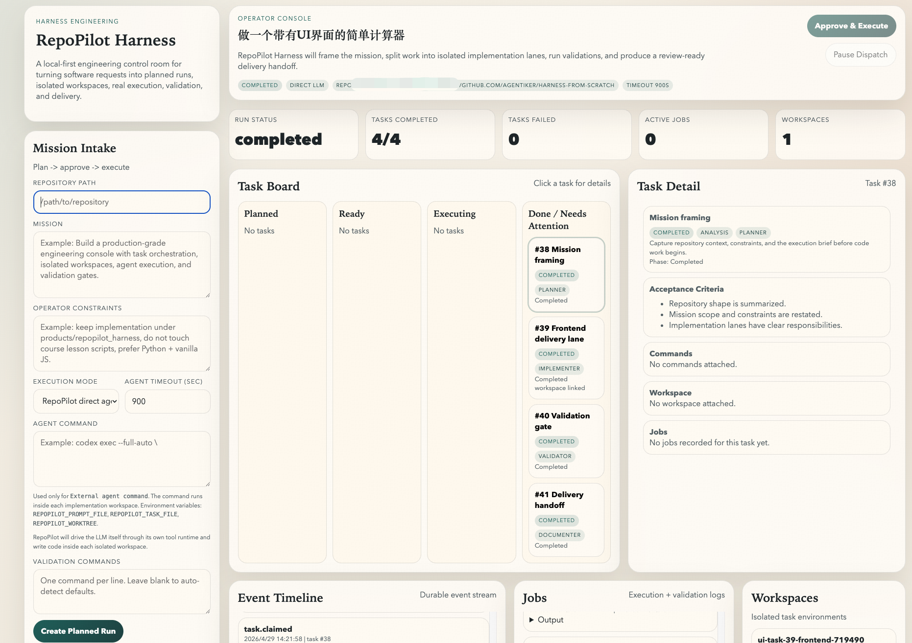

# Harness From Scratch

Harness From Scratch is a hands-on repository for learning how to build real agent harnesses, and then applying those lessons to a full graduation project: `RepoPilot Harness`.

It has two layers:

- `agents/`: the 12 progressive lessons that explain the core mechanics of agent runtimes
- `products/repopilot_harness/`: a real local-first engineering control plane built from those lessons

## Why this repository exists

Most agent demos stop at chat. This repository focuses on the harder part: execution infrastructure.

It shows how to go from:

`LLM call -> tool loop -> task system -> subagents -> background jobs -> protocols -> autonomous teammates -> isolated worktrees`

to a product that can actually manage software delivery work.

## What you will find here

### 1. The 12-lesson learning track

Each `agents/sXX_*.py` file introduces one capability in isolation so the harness architecture stays understandable.

- `s01`: minimal agent loop
- `s02`: tool use
- `s03`: todo state
- `s04`: subagents and context isolation
- `s05`: skill loading
- `s06`: context compaction
- `s07`: durable task system
- `s08`: background tasks
- `s09`: agent teams
- `s10`: team protocols
- `s11`: autonomous teammates
- `s12`: task-to-worktree isolation

Course materials live under `docs/`, including:

- `docs/course-outline-zh.md`
- `docs/lesson-test-log-zh.md`
- `docs/course-graduation-review-zh.md`
- `docs/s08-background-tasks-guide-zh.md`
- `docs/s09-agent-teams-guide-zh.md`
- `docs/s10-team-protocols-guide-zh.md`
- `docs/s11-autonomous-agents-guide-zh.md`
- `docs/s12-worktree-task-isolation-guide-zh.md`

### 2. The graduation project: RepoPilot Harness

`RepoPilot Harness` is the practical culmination of the course.

It turns a natural-language development mission into:

`mission intake -> planning -> task graph -> isolated workspaces -> implementation execution -> validation -> delivery handoff`

### Demo preview

Below is the current engineering console demo for `RepoPilot Harness`:



Current product capabilities include:

- operator console UI
- durable runs, tasks, jobs, workspaces, and events
- approval / pause / retry flow
- isolated implementation workspaces
- direct LLM execution or external agent command execution
- validation commands with persisted logs
- run recovery after restart
- file and artifact inspection in the UI

See `products/repopilot_harness/README.md` for product details.

## Repository structure

```text
.
├── agents/                         # 12 lesson scripts + earlier console prototype
├── docs/                           # Chinese course notes, plans, ADRs, demo writeups
├── lesson3_demo/                   # Small standalone demo used in the course
├── products/
│   └── repopilot_harness/          # Graduation project: real harness product
├── skills/                         # Loadable example skills
├── tests/                          # Course-level pytest suite
├── conftest.py
├── pyproject.toml
└── requirements.txt
```

## Quick start

### 1. Create your environment file

Create `.env` in the repository root:

```bash
cp .env.example .env
```

Then fill in at least:

```dotenv
ANTHROPIC_API_KEY=your_api_key
MODEL_ID=claude-opus-4-1
# Optional when using a compatible proxy endpoint
ANTHROPIC_BASE_URL=
```

Notes:

- `.env` is intentionally ignored by git
- if you use a third-party compatible endpoint, set `ANTHROPIC_BASE_URL`
- direct LLM execution requires both `ANTHROPIC_API_KEY` and `MODEL_ID`

### 2. Install dependencies

```bash
python3 -m pip install -r requirements.txt
```

Or install in editable mode:

```bash
python3 -m pip install -e .
```

### 3. Run the lessons

Start from lesson 1:

```bash
python3 agents/s01_agent_loop.py
```

Then continue upward lesson by lesson.

### 4. Run the graduation project

```bash
python3 products/repopilot_harness/backend/main.py
```

Open `http://127.0.0.1:8877` in your browser.

## Testing

Run the lesson and product tests:

```bash
python3 -m pytest tests products/repopilot_harness/tests -q
```

Examples:

```bash
python3 -m pytest tests/test_s07_task_system.py -q
python3 -m pytest products/repopilot_harness/tests/test_repopilot_harness_app.py -q
```

## Configuration model

The course lessons use `agents/auth.py` as the shared client bootstrap.

```python
from agents.auth import make_client

client, MODEL = make_client()
```

That factory centralizes:

- `.env` loading
- `MODEL_ID` lookup
- optional `ANTHROPIC_BASE_URL`
- compatible proxy safety handling when a custom base URL is set

The graduation project uses `products/repopilot_harness/backend/app/llm_client.py` for direct runtime execution and supports both:

- `direct_llm`: RepoPilot directly calls the LLM API
- `agent_command`: RepoPilot executes a real external coding agent command inside each workspace

## Recommended reading order

If you want the full learning path:

1. `docs/course-outline-zh.md`
2. `agents/s01_agent_loop.py` through `agents/s12_worktree_task_isolation.py`
3. `docs/lesson-test-log-zh.md`
4. `docs/course-graduation-review-zh.md`
5. `products/repopilot_harness/README.md`

## Project status

This repository is not a toy chat wrapper. The current graduation project already supports real local task execution and real file outputs inside isolated workspaces.

The next natural upgrades are:

- richer execution policies and safety controls
- diff review and merge workflows
- stronger multi-agent protocol orchestration
- better operator dashboards and replay tools

## License

MIT
