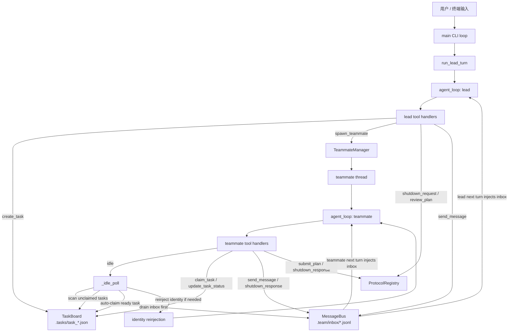

# 第 11 课讲解：Autonomous Agents 是如何实现的

这节课要解决的问题是：当前面的课程已经有了 lead、teammate、邮箱通信、后台任务和团队协议之后，为什么 agent 还是不够“像一个真的队友”？

答案是：因为前面的 teammate 大多仍然在等 lead 分配下一件事，而不是在没有明确指令时自己去找活、认领任务、做完回报、再继续待命。

`s11` 做的事情，可以概括成一句话：

- 把“会收消息的 persistent teammate”，升级成“会在空闲时自主寻找 ready task 的 autonomous teammate”

对应实现文件：`agents/s11_autonomous_agents.py`

---

## 一、先理解这节课的目标

第 11 课不是在追求“完全无人监管”的 AI，而是在已有 harness 的基础上，再往前推进一步，让 agent 多出一层最小自治能力。

这节课要达到的目标有 5 个：

1. teammate 在没有当前工作时，不是立刻结束，而是进入 `idle`
2. `idle` 状态下先看 inbox，再看 task board
3. 如果发现 ready task，就自动 claim 并恢复工作
4. 如果上下文被压缩得太短，能重新提醒自己“我是谁、我在什么团队里”
5. 如果一段时间都没有新工作，就优雅 shutdown

所以这节课最核心的能力不是“更会写代码”，而是：

- 更会维持长期协作状态
- 更会在任务池里自我调度
- 更不依赖 lead 的每一步明确指令

这正是 Harness Engineering for Real Agents 很重要的一步：

- 从“模型会做事”
- 走向“系统会组织模型持续做事”

---

## 二、为什么第 10 课的 Team Protocols 还不够

第 10 课已经补上了 shutdown 和 plan approval 这类结构化协议，这让团队协作更可靠了。但它仍然有一个限制：

- 协作是可靠的，不等于协作是主动的

在 `s10` 里，典型模式还是这样：

```text
lead 分配任务
-> teammate 执行
-> teammate 回报
-> teammate 等下一次分配
```

这已经比单 agent 强很多，但仍然偏“经理逐项派单”。

真实团队里，一个成熟队友通常不是每做完一步都停下来问：

- “我下一步干嘛？”

而是会自己观察：

- 有没有新消息
- 有没有 ready 的任务
- 有没有依赖已经解开的工作
- 当前是不是该继续等待还是收尾退出

第 11 课做的，就是把这种最小自驱行为放进 harness 里。

所以你可以把 `s11` 理解为：

- 在 `s10` 的协议层之上，再补一层“任务自治层”

---

## 三、这节课的核心设计：Inbox + Task Board + Idle Loop

第 11 课的主干架构可以概括成下面这条链路：

```text
lead 创建任务
-> 任务落到 .tasks/*.json
-> teammate 正常工作
-> 当前任务做完后调用 idle
-> harness 进入 idle polling
-> 先检查 inbox
-> 再扫描 task board
-> 如果发现 ready task，就自动 claim
-> 把任务重新注入上下文
-> teammate 恢复工作
-> 长时间没活则 shutdown
```

这里最关键的变化不是“新增了任务文件”，而是第一次出现了一个完整的自治循环：

```text
WORK -> IDLE -> WORK -> IDLE -> SHUTDOWN
```

这和前几课相比有本质区别。

- `s04` 的 subagent 是一次性 worker
- `s08` 的 background task 是一次性后台命令
- `s09` 的 teammate 是持久队友，但主要等消息
- `s10` 的 teammate 有协议，但仍然偏被动
- `s11` 的 teammate 才开始具备“自己找下一件事”的能力

这就是 Autonomous Agents 在这套课程里的真正含义：

- 不是完全自由发挥
- 而是受到 harness 约束的、有限自治的 agent

---

## 运行原理架构图

下面这张图，描述的是 `s11` 在一次完整运行中的关键组件和数据流：



如果你是在终端、纯文本编辑器，或者当前文档环境不支持 `mermaid`，可以看下面这版纯 ASCII 架构图：

```text
+------------------+
| 用户 / 终端输入   |
+------------------+
          |
          v
+------------------+       +----------------------+
| main CLI loop    | ----> | run_lead_turn        |
+------------------+       +----------------------+
                                   |
                                   v
                          +----------------------+
                          | agent_loop (lead)    |
                          +----------------------+
                                   |
                                   v
                          +----------------------+
                          | lead tool handlers   |
                          +----------------------+
                            |       |        |
          create_task ------+       |        +------ send_message
                            |       |                       |
                            v       |                       v
                 +----------------+ |          +--------------------------+
                 | TaskBoard      | |          | MessageBus               |
                 | .tasks/*.json  | |          | .team/inbox/*.jsonl      |
                 +----------------+ |          +--------------------------+
                            ^       |                       ^
                            |       |                       |
                            |       +------ shutdown / plan +------ inbox inject
                            |                  protocol             into next turn
                            |                       |
                            |                       v
                            |             +----------------------+
                            |             | ProtocolRegistry     |
                            |             +----------------------+
                            |
                            |
                    +----------------------+
                    | TeammateManager      |
                    +----------------------+
                              |
                              v
                    +----------------------+
                    | teammate thread      |
                    +----------------------+
                              |
                              v
                    +----------------------+
                    | agent_loop           |
                    | (teammate)           |
                    +----------------------+
                              |
                              v
                    +----------------------+
                    | teammate handlers    |
                    +----------------------+
                       |      |       |
                       |      |       +------ send_message / shutdown_response
                       |      |                      |
                       |      |                      v
                       |      +------ claim_task / update_task_status
                       |                             |
                       |                             v
                       |                     +----------------+
                       |                     | TaskBoard      |
                       |                     +----------------+
                       |
                       +------ idle
                               |
                               v
                    +----------------------+
                    | _idle_poll           |
                    +----------------------+
                       |              |
       drain inbox ----+              +---- scan_unclaimed_tasks
                       |                              |
                       v                              v
              +------------------+          +------------------+
              | MessageBus       |          | TaskBoard        |
              +------------------+          +------------------+
                                                      |
                                                      v
                                             auto-claim ready task
                                                      |
                                                      v
                                           +----------------------+
                                           | reinject_identity    |
                                           +----------------------+
                                                      |
                                                      v
                                           resume teammate work
```

你可以把它简化理解成 5 个层次：

- `CLI / run_lead_turn / agent_loop`：前台 lead 的交互入口
- `TeammateManager`：负责拉起、维护、收尾 autonomous teammate
- `TaskBoard`：负责任务落盘、依赖判断、ready task 扫描和 claim
- `MessageBus + ProtocolRegistry`：分别负责消息传递和结构化协议状态
- `_idle_poll + identity reinjection`：负责“空闲时找活”和“上下文变短时找回身份”

如果只抓住一条主线，可以记成：

```text
lead 创建任务 / 拉起队友
-> teammate 工作完成后进入 idle
-> harness 先查 inbox，再查 task board
-> 发现 ready task 就自动 claim
-> 把新任务重新注入 teammate 上下文
-> teammate 继续工作
-> 长时间无消息无任务则 shutdown
```

---

## 四、`TaskBoard`：这节课新增的任务自治基础设施

这节课最关键的新组件之一，是 `TaskBoard`，定义在 `agents/s11_autonomous_agents.py:246`。

你可以把它理解成一个最小任务看板，负责集中管理：

- 任务创建
- 任务读取
- 状态更新
- ready task 扫描
- 任务认领

### 1）任务是如何落盘的

`create_task()` 在 `agents/s11_autonomous_agents.py:285`。

每个任务会被写成 `.tasks/task_<id>.json`，并带上这些核心字段：

- `id`
- `title`
- `description`
- `status`
- `dependencies`
- `owner`
- `created_at`

这和前面 `.team/config.json`、`.team/inbox/*.jsonl` 的设计一脉相承：

- 状态尽量落盘
- 结构尽量可见
- 便于教学、调试和断言

### 2）ready task 是怎么判断的

`scan_unclaimed_tasks()` 在 `agents/s11_autonomous_agents.py:321`。

它只会返回满足以下条件的任务：

- `status == pending`
- 当前没有 `owner`
- 所有依赖都已经 `completed`

这就是第 11 课最值得学的一个点：

- “是否可做”不是模型自己想象出来的
- 而是 harness 用明确规则判定出来的

也就是说，自治并不等于放权给模型随便挑，而是：

- harness 先算出 ready set
- agent 再在这个 ready set 上行动

### 3）任务认领做了哪些保护

`claim_task()` 在 `agents/s11_autonomous_agents.py:334`。

它会检查：

- 任务是否存在
- 是否已经被别人 claim
- 当前状态是不是 `pending`
- 依赖是否都已完成

只有全部满足，才会把：

- `owner = <teammate>`
- `status = in_progress`

写回任务文件。

所以 claim 不是一句口头承诺，而是一次真正的状态迁移。

---

## 五、`TeammateManager._idle_poll()`：自治行为真正发生的地方

第 11 课真正“活起来”的地方，是 `TeammateManager._idle_poll()`，定义在 `agents/s11_autonomous_agents.py:531`。

你可以把它理解成 teammate 的待命循环。

它的行为顺序很重要：

### 第一步：先看 inbox

如果队友 inbox 里有新消息，`_idle_poll()` 会优先把消息注入到当前 agent state。

这么设计的原因很合理：

- 人类队友在空闲时，通常先看有没有新消息
- 新消息可能比任务板上的公共任务优先级更高
- 特别是 `shutdown_request` 这类控制消息，必须先处理

所以 inbox 优先于 task board。

### 第二步：再扫描 task board

如果 inbox 没有新消息，它才会调用 `TaskBoard.scan_unclaimed_tasks()` 去找 ready task。

一旦发现任务：

1. 先执行 `claim_task`
2. 必要时重注入 identity
3. 把任务包装成 `<auto-claimed>...</auto-claimed>` 注入消息历史
4. 给自己补一条 assistant 消息，表示“我已经认领，继续工作”
5. 返回主循环继续跑模型

这里有个非常巧妙的点：

- harness 并没有直接替模型做完整任务
- 它只是把“你刚刚自动认领了一件事”变成新的上下文事实

于是后续工作依然由模型负责完成，但任务切换和状态迁移由 harness 控制。

### 第三步：超时后关闭

如果既没有 inbox，也没有 ready task，那么 `_idle_poll()` 会按 `POLL_INTERVAL` 周期轮询，直到超过 `IDLE_TIMEOUT`。

默认值在文件顶部：

- `POLL_INTERVAL = 5.0`
- `IDLE_TIMEOUT = 60.0`

超时后返回 `False`，外层 teammate loop 就会把该成员收尾到 `shutdown`。

这保证了 agent 不会永远空转。

---

## 六、为什么这节课要做 identity reinjection

`s11` 另一个非常有教学价值的设计，是 `reinject_identity_if_needed()`，定义在 `agents/s11_autonomous_agents.py:583`，以及 `make_identity_block()`，定义在 `agents/s11_autonomous_agents.py:593`。

它解决的问题是：

- 当 teammate 长时间运行、上下文被压缩得很短时，模型可能慢慢“忘记自己是谁”

这在真实 agent 系统里很常见。因为随着消息滚动，最早的身份信息和工作设定可能被挤出短上下文窗口。

这里的处理办法很务实：

- 如果当前 message history 很短
- 且前面没有现成的 identity block
- 就在最前面插入一段 `<identity>` 消息

内容大意是：

- 你是哪个 teammate
- 你的 role 是什么
- 你属于哪个 team
- 继续当前工作

然后再补一条 assistant acknowledgement，例如：

```text
I am alice. Continuing.
```

这一步非常像在做“最小自我恢复”。

它的重要意义在于：

- 不要指望模型永远稳定记住身份
- 当身份对后续行为很关键时，harness 要主动补锚点

这正是 Real Agents 里很典型的一种工程思想：

- 不是信任模型记忆永远可靠
- 而是在关键节点重新注入稳定约束

---

## 七、`build_tools()`：lead 和 teammate 的工具职责进一步分化

`build_tools()` 定义在 `agents/s11_autonomous_agents.py:680`。

这节课里，lead 和 teammate 的工具集比前一课分工更清晰。

### lead 侧新增的任务管理工具

lead 除了团队管理和协议工具之外，还拥有：

- `create_task`
- `list_tasks`
- `get_task`
- `update_task_status`

其中 `create_task` 的注册在 `agents/s11_autonomous_agents.py:877` 附近，实际处理在 `make_tool_handlers()` 的 `create_task()` 分支里，对应 `agents/s11_autonomous_agents.py:1038`。

这一点和上游最小实现相比，是一个非常适合课堂演示的本地增强：

- lead 可以直接在同一个脚本里创建任务
- 不需要手动编辑 `.tasks/*.json`
- 更容易在终端里实时观察 agent 自主认领的全过程

### teammate 侧新增的自治工具

teammate 这边新增两个关键工具：

- `idle`
- `claim_task`

对应定义分别在：

- `agents/s11_autonomous_agents.py:922`
- `agents/s11_autonomous_agents.py:927`

实际 handler 在：

- `agents/s11_autonomous_agents.py:1104`
- `agents/s11_autonomous_agents.py:1107`

它们的职责非常明确：

- `idle`：告诉 harness，“我现在没有立即要做的工作，请进入待命轮询”
- `claim_task`：允许队友主动认领 ready task

这意味着第 11 课的 agent 已经不再只是“收到任务 -> 做任务”，而是多了一步：

- 自己声明“我空了”
- 再由 harness 帮它在空闲期寻找下一件工作

---

## 八、`agent_loop()` 在这一课里的关键变化

`agent_loop()` 定义在 `agents/s11_autonomous_agents.py:1116`。

表面上看，它还是熟悉的“模型输出 text / tool_use，harness 执行工具，再把 tool_result 回灌”的循环，但这一课有一个很关键的增强：

- 它支持 `stop_tools`

在 lead 侧，`run_lead_turn()` 会把 `end_turn` 作为 stop tool，定义在 `agents/s11_autonomous_agents.py:1178`。

在 teammate 侧，`_teammate_loop()` 会把：

- `idle`
- `shutdown_response`

作为 stop tools。

这意味着：

- 当 teammate 调用了 `idle`，当前这段主动工作就暂时告一段落
- 控制权返回 harness，交给 `_idle_poll()` 决定下一步是继续工作还是退出

这一点非常关键，因为它体现了 harness 和 model 的职责边界：

- model 负责说“我现在该 idle 了”
- harness 负责真正执行 idle 生命周期管理

如果没有这个 stop tool 机制，模型即使调用了 `idle`，主循环也可能继续滚下去，自治状态就不清晰了。

---

## 九、第 11 课的完整生命周期是什么样

把这些组件串起来，第 11 课的完整 teammate 生命周期可以写成这样：

```text
lead 创建任务
-> lead spawn_teammate
-> teammate 开始工作
-> 当前工作完成后调用 idle
-> harness 进入 _idle_poll
-> 若 inbox 有消息，则恢复工作处理消息
-> 若 task board 有 ready task，则自动 claim 并恢复工作
-> 若持续无消息无任务，则 idle timeout
-> teammate graceful shutdown
```

也就是：

```text
WORK -> IDLE -> WORK/SHUTDOWN
```

这就是第 11 课最核心的教学结果。

从系统视角看，这意味着 harness 第一次具备了“持续调度 agent”的雏形。

从 agent 视角看，这意味着 teammate 第一次不再完全依赖 lead 明确派工。

从工程视角看，这意味着我们离真实的长期运行 agent 又近了一步。

---

## 十、如何在终端里观察这节课

这节课最适合直接跑交互式脚本：

```bash
python3 agents/s11_autonomous_agents.py
```

进入后，建议重点观察 4 个入口：

- `/tasks`
- `/team`
- `/inbox`
- `/protocols`

### 一个最推荐的实验流程

1. 先创建一个无依赖任务
2. 再创建一个依赖前者的任务
3. spawn `alice`
4. 观察 `alice` 进入 `idle` 后自动认领第一个任务
5. 观察第一个任务完成后，第二个任务因为依赖解除而变成 ready
6. 再 spawn `bob`，让它自动认领第二个任务
7. 最后等待空闲超时，观察 `alice` / `bob` 变成 `shutdown`

### 你可以看到什么

- teammate 的工具调用日志会直接打印在终端里
- `/tasks` 能看到任务从 `pending -> in_progress -> completed`
- `/team` 能看到成员从 `working -> idle -> shutdown`
- `/inbox` 能看到 agent 给 lead 发的状态消息
- `/protocols` 能继续观察 shutdown / plan approval 这类协议状态

所以第 11 课非常适合教学，因为它把“agent 自治”做成了可观察状态机，而不是只能靠想象理解。

---

## 十一、为什么这节课对 Real Agents 很关键

如果只看功能，第 11 课似乎只是“自动领任务”。但从更大的视角看，它其实补的是真实 agent 系统里非常关键的一层：

- work discovery
- lifecycle management
- self-resumption
- graceful idle exit

也就是说，agent 不再只是在你每次敲一条命令时才活一下，而开始具备：

- 没事时待命
- 有事时接活
- 做完后回报
- 再次待命
- 长期没事就退出

这已经很接近真实组织中的“初级自治员工”模型了。

而且这一步是后续更复杂能力的基础。因为一旦 agent 会：

- 自己找任务
- 自己认领任务
- 自己恢复身份
- 自己在空闲和工作之间切换

后面你就可以继续往上叠加：

- worktree 隔离
- 更强的 task routing
- 更细的资源锁
- 多 agent 的真实流水线协作

所以第 11 课不是一个边角功能，而是整个课程从“多 agent 通信”走向“多 agent 自治调度”的分水岭。

---

## 十二、这节课你最应该记住的 6 个点

如果只带走最重要的内容，我建议记住下面 6 句话：

1. `s11` 的核心不是“会做任务”，而是“会自己找下一件任务”
2. 自治不是放任模型自由发挥，而是 harness 先算 ready task，再让模型行动
3. `idle` 是一个状态切换信号，不只是一个普通工具调用
4. `TaskBoard` 把任务可做性、依赖、认领和状态迁移收敛成了明确规则
5. `reinject_identity_if_needed()` 说明真实 agent 系统必须考虑上下文退化后的身份恢复
6. 第 11 课标志着系统从“team communication”进入“team self-scheduling”阶段

---

## 十三、建议你结合代码重点阅读的位置

如果你准备边读边跑，我建议按下面顺序看源码：

1. `agents/s11_autonomous_agents.py:246` 的 `TaskBoard`
2. `agents/s11_autonomous_agents.py:531` 的 `_idle_poll()`
3. `agents/s11_autonomous_agents.py:583` 的 `reinject_identity_if_needed()`
4. `agents/s11_autonomous_agents.py:680` 的 `build_tools()`
5. `agents/s11_autonomous_agents.py:937` 的 `make_tool_handlers()`
6. `agents/s11_autonomous_agents.py:1116` 的 `agent_loop()`
7. `agents/s11_autonomous_agents.py:1178` 的 `run_lead_turn()`
8. `agents/s11_autonomous_agents.py:1200` 的 `main()`

这样读会比较顺，因为你会先理解：

- 任务从哪里来
- 空闲时怎么找任务
- 找到任务后怎么恢复工作
- 最后整个 CLI 是怎么把这些能力串起来的

---

## 十四、小结

第 11 课解决的，不是“如何让模型更聪明”，而是“如何让 agent 在团队里更像一个能持续工作的成员”。

它通过 4 个关键设计把这一点落地了：

- `TaskBoard` 提供任务自治基础设施
- `_idle_poll()` 提供 work discovery 循环
- `reinject_identity_if_needed()` 提供身份恢复机制
- `idle -> auto-claim -> resume work -> timeout shutdown` 提供完整生命周期

如果说：

- 第 9 课是让 agent 开始成为“队友”
- 第 10 课是让队友之间开始“按协议协作”

那么第 11 课就是：

- 让队友开始“自己找活干”

这就是 Autonomous Agents 在这套课程里的真正工程含义。
